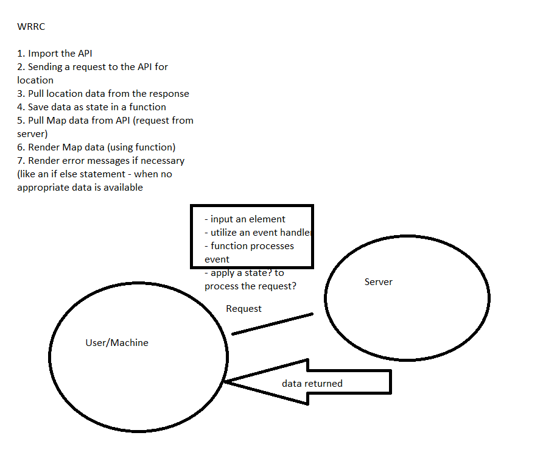
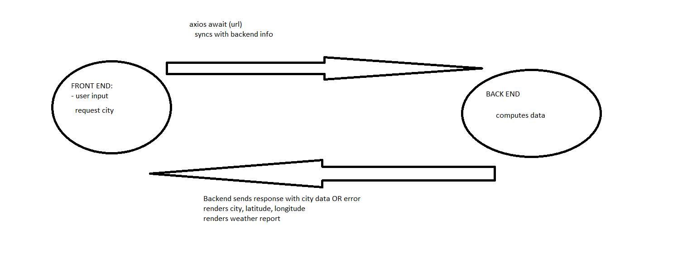
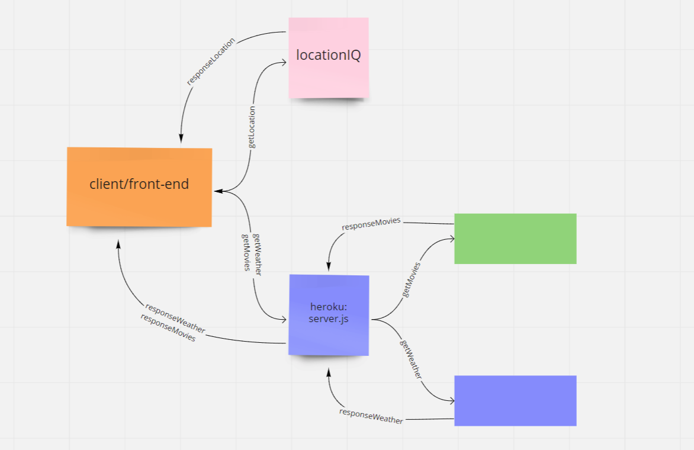

# City Explorer

**Author**: Katy Roffe
**Version**: 1.0.0 (increment the patch/fix version number if you make more commits past your first submission)

## Overview
City Explorer is a React application that allows a user to retrieve a map and coordinates of a location through a 3rd-party API. 

## Getting Started

## Architecture

**Languages:** HTML, CSS, JavaScript
**Libraries:** React
**APIs:** Axios
**Technologies:**  

## Change Log
9-21-2021 2:15pm - Application has a fully rendering form.
9-22-2021 6:30pm - Application's Bootstrap componenets have been restyled and now map is rendering
9-22-201 9:20pm - LocalHost server connected

## Credit and Collaborations
**Peer Programming:** Jovincent del Mundo, Bryce Pfingston, Brian Kasprzyk 
**Collabortions:** Brian Kasprzyk, Cameron Walden, George Mead

## Time Estimates

>- Feature name: Setup
>- Estimate of time needed to complete: 40 minutes
>- Start time: 3:00
>- Finish time: 3:50
>- Actual time needed to complete: 50 minutes
---
>- Feature name: Locations
>- Estimate of time needed to complete: 2 hours
>- Start time: 4:00
>- Finish time: 6:00
>- Actual time needed to complete: 2 Hours
---
>- Feature name: Locations & Map
>- Estimate of time needed to complete: 2 hours
>- Start time: 4:00
>- Finish time: 6:00
>- Actual time needed to complete: 2 Hours

>- Feature name: Weather Server (placeholder)
>- Estimate of time needed to complete: 4 hours
>- Start time: 6:30
>- Finish time: 9:00
>- Actual time needed to complete: 2.5 hours

>- Feature name: Weather Server (live)
>- Estimate of time needed to complete: 4
>- Start time: 10:30
>- Finish time: -
>- Actual time needed to complete: in process

>- Feature name: Styling
>- Estimate of time needed to complete: Ongoing
>- Start time: -
>- Finish time: -
>- Actual time needed to complete: in process